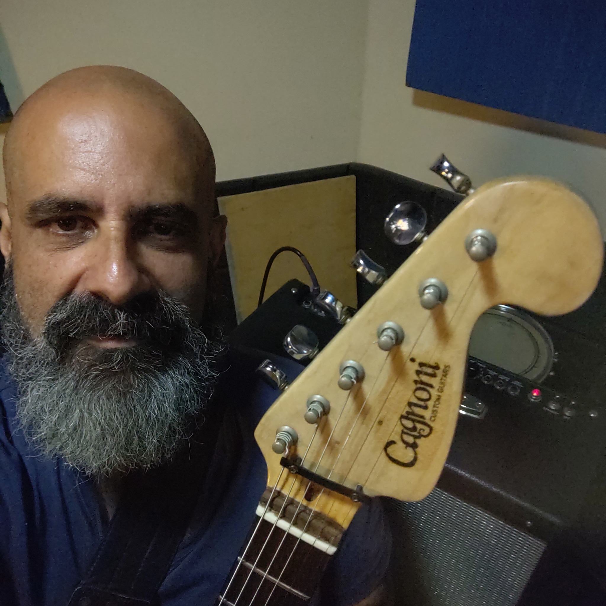

# Frontend Mentor - Social links profile solution

This is a solution to the [Social links profile challenge on Frontend Mentor](https://www.frontendmentor.io/challenges/social-links-profile-UG32l9m6dQ). Frontend Mentor challenges help you improve your coding skills by building realistic projects. 

## Table of contents

- [Overview](#overview)
  - [The challenge](#the-challenge)
  - [Screenshot](#screenshot)
  - [Links](#links)
- [My process](#my-process)
  - [Built with](#built-with)
  - [What I learned](#what-i-learned)
  - [Continued development](#continued-development)
- [Author](#author)


**Note: Delete this note and update the table of contents based on what sections you keep.**

## Overview

### The challenge

Users should be able to:

- See hover and focus states for all interactive elements on the page

### Screenshot


### Links

- Solution URL: [Social links github](https://github.com/GleberC/social_links)
- Live Site URL: [Social Links](https://social-links-seven-dusky.vercel.app/)

## My process

### Built with

- Semantic HTML5 markup
- CSS custom properties
- Flexbox
- CSS Grid
- Mobile-first workflow


### What I learned

I used, on the suggestion of a colleague from 'Frontend Mentor', a screen percentage styling, and that way I managed to make the screen responsive in a simpler way.
I tried to use responsive tags in a way that they would be reusable for new projects.

To see how you can add code snippets, see below:

```html
<Main class="personal_box">
    

    <h1 id="name">
      Gleber Cagnoni
    </h1>

    <h2>
      São Paulo, Brazil
    </h2>
    <h3>
      "Front-end Developer and Guitar Luthier."
    </h3>

    <ul class="social_list">

      <li class="box">
        <a href="https://github.com/GleberC">
          <button class="social_link" type="button">GitHub</button>
        </a>
      </li>
     
    </ul>


  </Main>
```
```css
body {  
    width: 100vw;
    height: 100vh;
}
```

### Continued development

I am still working on CSS styles to improve my skills.


## Author

- Website - [Gleber](https://www.linkedin.com/in/gleber-cagnoni-99b23217/)
- Frontend Mentor - [@GleberC](https://www.frontendmentor.io/profile/GleberC)


